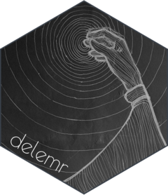

<!-- README.md is generated from README.Rmd. Please edit that file -->

# delemr 

<!-- badges: start -->

[](https://github.com/m-delem/delemr/actions/workflows/R-CMD-check.yaml)
<!-- badges: end -->

This package contains a collection of functions that I have developed
for various purposes in my work. These functions are not necessarily
related to each other, they only have in common that they have been
useful to me at some point.

<!-- If one of those caught your eye, you can install `delemr` like so:
``` r
# install.packages("devtools")
devtools::install_github("m-delem/delemr")
```
-->

*(The package logo and website were just for fun* :eyes: *- and learning
how to create them.)*
